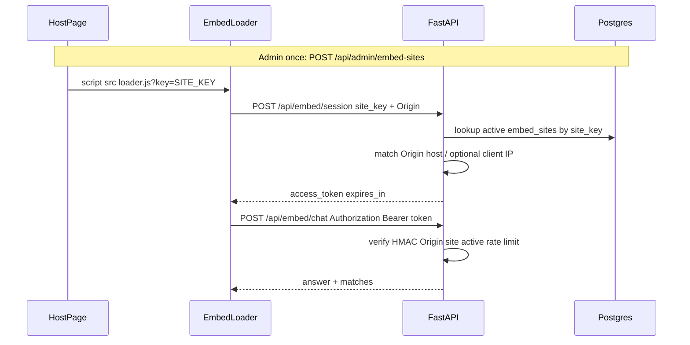

# Embed Abuse Protection — Domain Keys & Session Tokens

**Author:** Sanju  
**Date:** 2026-08-06  
**Branch:** `feature/embeddable-chat-widget`

This document describes the **embed abuse-protection** feature: registering websites with unique site keys, issuing short-lived domain-bound session tokens, dynamic CORS, rate limits, and HTTPS/security headers so unauthorized hosts cannot freely call the resume chat API.

Related widget install docs: [README.md](./README.md).

### File status legend

| Abbr | Meaning |
|------|---------|
| **[NEW]** | Created for this feature (did not exist before) |
| **[MOD]** | Pre-existing file, changed to support this feature |
| **[PRE]** | Pre-existing file, **not** changed for embed auth (referenced for context only) |

---

## What has been done

| Capability | Behaviour |
|------------|-----------|
| Domain registration | Admin registers a hostname → unique public `site_key` (`aicv_…`) |
| Snippet generation | Loader URL includes `?key=…`; API can generate the one-liner |
| Session minting | `POST /api/embed/session` validates Origin/Referer (+ optional IP allowlist) |
| Chat/search gate | Embed-only: Bearer required on `/api/embed/chat` and `/api/embed/search` (legacy `/api/chat` unchanged) |
| Token design | HMAC-SHA256, ~10 min TTL, bound to `site_id` + origin host |
| Dynamic CORS | Only `FRONTEND_ORIGIN` + active registered domains (not open `*` by default) |
| Rate limits | In-process sliding window per IP and per site key |
| Transport hardening | Security headers; HTTPS enforced in production |
| Ops CLI | `scripts/register_embed_site.py` prints key + snippet |
| Legacy APIs | `/api/chat`, `/api/search`, Next.js UI left unchanged |

**Not in scope:** end-user OAuth, CAPTCHA/WAF, Redis-backed distributed rate limits.

---

## Architecture / structure

```
aiCVchat/
├── embed/                                    [NEW] folder
│   ├── aicvchat-widget.js                    [NEW]
│   ├── config.js                             [NEW]
│   ├── demo.html / snippet.html              [NEW]
│   ├── README.md                             [NEW]
│   └── ABUSE_PROTECTION.md                   [NEW]
├── backend/
│   ├── app/
│   │   ├── models/embed_site.py              [NEW]
│   │   ├── schemas/embed.py                  [NEW]
│   │   ├── core/
│   │   │   ├── embed_tokens.py               [NEW]
│   │   │   ├── rate_limit.py                 [NEW]
│   │   │   ├── middleware.py                 [NEW]
│   │   │   └── config.py                     [MOD]  EMBED_* / TRUST_PROXY / CORS defaults
│   │   ├── services/embed_site_service.py    [NEW]
│   │   ├── api/
│   │   │   ├── embed.py                      [NEW]  loader, session, /api/embed/chat|search
│   │   │   ├── embed_admin.py                [NEW]  /api/admin/embed-sites*
│   │   │   ├── deps.py                       [NEW]  require_embed_session
│   │   │   ├── admin.py                      [PRE]  ingest/reindex only
│   │   │   ├── chat.py / search.py           [PRE]  legacy APIs (ungated)
│   │   │   └── resumes.py                    [PRE]
│   │   └── db/
│   │       ├── init_db.py                    [MOD]  registers EmbedSite model
│   │       └── session.py                    [MOD]  connect_timeout
│   ├── scripts/register_embed_site.py        [NEW]
│   ├── main.py                               [MOD]  middleware + /embed mount + routers
│   └── .env.example                          [MOD]  documents EMBED_* / TRUST_PROXY
└── frontend/                                 [PRE]  unchanged for embed auth
```

### Database

Table **`embed_sites`**:

| Column | Type | Notes |
|--------|------|--------|
| `id` | UUID | PK |
| `site_key` | string | Unique public key |
| `name` | string | Ops label |
| `domain` | string | Normalized hostname |
| `allow_subdomains` | bool | Allow `*.domain` |
| `allowed_ips` | JSON list | Empty = any IP |
| `is_active` | bool | False after revoke |
| `rate_limit_per_minute` | int | Per-site budget |
| `created_at` / `revoked_at` | datetime | Lifecycle |

Created via SQLAlchemy `create_all` on startup (no Alembic).

---

## Request flow



1. **Register** domain (admin token) → receive `site_key` + HTML snippet.  
2. **Install** `<script src="https://api…/embed/loader.js?key=…">` on that domain only.  
3. Widget **opens session**; server checks Origin against registered domain.  
4. Widget **chats** via **`POST /api/embed/chat`** with `Authorization: Bearer <token>` (legacy `/api/chat` is untouched). Token expires (~600s) and is refreshed client-side before expiry.

---

## Files inventory

### [NEW] — Created for this feature

| Status | File | Role |
|--------|------|------|
| **[NEW]** | [`backend/app/models/embed_site.py`](../backend/app/models/embed_site.py) | ORM `embed_sites` table |
| **[NEW]** | [`backend/app/schemas/embed.py`](../backend/app/schemas/embed.py) | Pydantic DTOs |
| **[NEW]** | [`backend/app/core/embed_tokens.py`](../backend/app/core/embed_tokens.py) | HMAC mint/verify + site key gen |
| **[NEW]** | [`backend/app/core/rate_limit.py`](../backend/app/core/rate_limit.py) | IP/site sliding windows |
| **[NEW]** | [`backend/app/core/middleware.py`](../backend/app/core/middleware.py) | Dynamic CORS + security headers |
| **[NEW]** | [`backend/app/services/embed_site_service.py`](../backend/app/services/embed_site_service.py) | Domain/IP/CORS helpers |
| **[NEW]** | [`backend/app/api/embed.py`](../backend/app/api/embed.py) | Loader, snippet, session, `/api/embed/chat` + `/api/embed/search` |
| **[NEW]** | [`backend/app/api/embed_admin.py`](../backend/app/api/embed_admin.py) | Embed-site create/list/revoke/rotate |
| **[NEW]** | [`backend/app/api/deps.py`](../backend/app/api/deps.py) | `require_embed_session` (embed routes only) |
| **[NEW]** | [`backend/scripts/register_embed_site.py`](../backend/scripts/register_embed_site.py) | CLI registration |
| **[NEW]** | `embed/aicvchat-widget.js` | Widget UI + session + chat |
| **[NEW]** | `embed/config.js` | Defaults including `siteKey` |
| **[NEW]** | `embed/demo.html` | Local demo (`?key=`) |
| **[NEW]** | `embed/snippet.html` | Snippet helper UI |
| **[NEW]** | `embed/README.md` | Widget install guide |
| **[NEW]** | `embed/ABUSE_PROTECTION.md` | This document |

### [MOD] — Pre-existing, modified for this feature

| Status | File | Change |
|--------|------|--------|
| **[MOD]** | `backend/app/core/config.py` | `EMBED_*` / `TRUST_PROXY`; CORS default tightened |
| **[MOD]** | `backend/main.py` | Middleware; `/embed` mount; embed routers |
| **[MOD]** | `backend/app/db/init_db.py` | Import `EmbedSite` for `create_all` |
| **[MOD]** | `backend/app/db/session.py` | DB `connect_timeout` |
| **[MOD]** | `backend/.env.example` | Document embed/CORS env vars |

### [PRE] — Pre-existing, unchanged (context only)

| Status | File | Notes |
|--------|------|--------|
| **[PRE]** | `backend/app/api/chat.py` | Legacy `/api/chat` — no embed session required |
| **[PRE]** | `backend/app/api/search.py` | Legacy `/api/search` |
| **[PRE]** | `backend/app/api/resumes.py` | Legacy `/api/request-resumes` |
| **[PRE]** | `backend/app/api/admin.py` | Ingest/reindex only (token check unchanged) |
| **[PRE]** | `frontend/**` | Next.js UI — still uses legacy APIs |

---
## Impact

| Area | Impact |
|------|--------|
| **Third-party embeds** | Must use registered domain + `site_key`; call `/api/embed/chat` with session |
| **Legacy Next.js /api/chat** | Unchanged — no site key required |
| **Open embed abuse** | Unauthorized origins cannot obtain sessions or call `/api/embed/*` protected routes |
| **CORS** | Unknown origins denied (unless `CORS_ALLOW_ANY_ORIGIN=true` emergency) |
| **Ops** | Register each customer domain before embed go-live; rotate keys on compromise |
| **Postgres** | New `embed_sites` table required for registration/session |
| **Performance** | Token verify is local HMAC; CORS origins cached ~30s; rate limits are in-process (per machine) |

**Break-glass (local only):** `EMBED_AUTH_REQUIRED=false` — disables the **embed** chat/search gate (`/api/embed/chat`). Does not affect legacy `/api/chat`. Do not use in production.

---

## Environment variables

| Variable | Default | Meaning |
|----------|---------|---------|
| `EMBED_AUTH_REQUIRED` | `true` | Gate `/api/embed/chat` and `/api/embed/search` with Bearer token |
| `EMBED_TOKEN_SECRET` | _(empty → weak dev fallback)_ | HMAC secret — **set in production** |
| `EMBED_TOKEN_TTL_SECONDS` | `600` | Session lifetime |
| `EMBED_RATE_LIMIT_PER_MINUTE` | `20` | Per client IP |
| `EMBED_SITE_RATE_LIMIT_PER_MINUTE` | `60` | Per site key |
| `EMBED_REQUIRE_HTTPS` | _(unset → on if `APP_ENV=production`)_ | Reject non-HTTPS sessions/chat |
| `TRUST_PROXY` | `false` | Trust `X-Forwarded-*` / `X-Real-IP` (only behind your proxy) |
| `CORS_ALLOW_ANY_ORIGIN` | `false` | Emergency open CORS |
| `FRONTEND_ORIGIN` | `http://localhost:3000` | Always-allowed frontends (comma-separated) |
| `ADMIN_TOKEN` | — | Required for site registration APIs |
| `NEXT_PUBLIC_API_BASE_URL` | `http://localhost:8000` | API base for Next.js (unchanged; no embed key) |

---

## How to use

### 1. Start backend (Postgres required for sites table)

```bash
cd backend
# ensure .env has EMBED_AUTH_REQUIRED=true and EMBED_TOKEN_SECRET=…
python main.py
```

### 2. Register a domain

```bash
cd backend
python scripts/register_embed_site.py --name "Local demo" --domain localhost
```

Or:

```bash
curl -X POST http://localhost:8000/api/admin/embed-sites \
  -H "X-Admin-Token: YOUR_ADMIN_TOKEN" \
  -H "Content-Type: application/json" \
  -d "{\"name\":\"Acme Careers\",\"domain\":\"careers.acme.com\",\"allow_subdomains\":false}"
```

Response includes `site_key` and `snippet`.

**Admin extras:**

- `GET /api/admin/embed-sites` — list  
- `POST /api/admin/embed-sites/{id}/revoke` — deactivate  
- `POST /api/admin/embed-sites/{id}/rotate-key` — new key (update all snippets)

### 3. Install on the website

Paste the snippet (host + key already filled):

```html
<script src="https://YOUR-API-HOST/embed/loader.js?key=aicv_…" async></script>
```

Optional: `openOnLoad=1`, `position=left`.

Helpers:

- `http://localhost:8000/embed/demo.html?key=aicv_…`
- `http://localhost:8000/embed/snippet.html?key=aicv_…`
- `GET /api/embed/snippet?key=aicv_…`

### 4. Next.js local app

No embed site key needed. The Next.js UI keeps using `/api/chat` as before.

### 5. Production checklist

- [ ] Strong `EMBED_TOKEN_SECRET` and `ADMIN_TOKEN`  
- [ ] `EMBED_AUTH_REQUIRED=true`  
- [ ] `CORS_ALLOW_ANY_ORIGIN=false`  
- [ ] `APP_ENV=production` (or `EMBED_REQUIRE_HTTPS=true`) behind TLS  
- [ ] Register only real customer hostnames  
- [ ] Prefer IP allowlists for high-risk embeds  
- [ ] Plan Redis rate limits if you run multiple API instances  

---

## API quick reference

| Method | Path | Auth | Status | Purpose |
|--------|------|------|--------|---------|
| `POST` | `/api/admin/embed-sites` | `X-Admin-Token` | **[NEW]** | Register domain → `site_key` |
| `GET` | `/api/admin/embed-sites` | `X-Admin-Token` | **[NEW]** | List sites |
| `POST` | `/api/admin/embed-sites/{id}/revoke` | `X-Admin-Token` | **[NEW]** | Deactivate |
| `POST` | `/api/admin/embed-sites/{id}/rotate-key` | `X-Admin-Token` | **[NEW]** | New key |
| `POST` | `/api/embed/session` | Origin + `site_key` body | **[NEW]** | Mint Bearer token |
| `GET` | `/embed/loader.js?key=` | — | **[NEW]** | Dynamic loader JS |
| `GET` | `/api/embed/snippet?key=` | — | **[NEW]** | Generated HTML snippet |
| `POST` | `/api/embed/chat` | Bearer embed session | **[NEW]** | Secured chat for widget |
| `POST` | `/api/embed/search` | Bearer embed session | **[NEW]** | Secured search for widget |
| `POST` | `/api/chat` | None | **[PRE]** | Legacy Next.js / API chat |
| `POST` | `/api/search` | None | **[PRE]** | Legacy search |

### Session request / response

**Request body:** `{ "site_key": "aicv_…" }`  
**Headers:** browser sends `Origin` (or `Referer`).

**Response:**

```json
{
  "access_token": "…",
  "expires_in": 600,
  "api_base_url": "https://api.example.com",
  "token_type": "Bearer"
}
```

---

## Security notes for future development

- Site keys in HTML are **public**; never treat them as passwords. Binding + short TTL + rate limits + HTTPS are the real controls.  
- On revoke/rotate, invalidate CORS cache is already called (`invalidate_cors_cache`). Tokens with the old `site_key` are rejected after rotate.  
- Multi-instance: replace `ip_limiter` / `site_limiter` in `rate_limit.py` with Redis.  
- New embed endpoints that burn LLM/DB should use `Depends(require_embed_session)` on `/api/embed/*` only — do not gate legacy `/api/chat`.
- Set `TRUST_PROXY=true` only behind a reverse proxy you control; otherwise clients can spoof `X-Forwarded-For` / Host.

### Review fixes (2026-08-06)

| Issue | Fix |
|-------|-----|
| Session fell back to `Host` (API host) when Origin missing — bypassed domain binding | Require Origin/Referer only |
| Chat skipped Origin check when header absent (stolen token usable via curl) | Require Origin/Referer and match token host |
| Key rotate left old tokens valid until TTL | Compare token `sk` to current DB `site_key` |
| `X-Forwarded-*` trusted unconditionally | Gated by `TRUST_PROXY` |
| CORS host-only match allowed http↔https downgrade | Exact origin; localhost aliases only |
| Bare TLD registration (`com` + subdomains) | `is_safe_registered_domain` |
| Admin token `!=` compare | `hmac.compare_digest` |
| `/api/request-resumes` ungated | Left on legacy API; embed does not use it |
| Per-site rate limit ignored on chat | Applied on `/api/embed/chat` |
| Weak prod HMAC secret | Session mint fails if secret empty in production |
| Loader JS string injection via `key` query | Charset allowlist + `repr` embedding |
| Auth applied to Next.js / legacy chat | **Reverted** — security scoped to embed routes only |

---

## License

Same as the parent repository.
