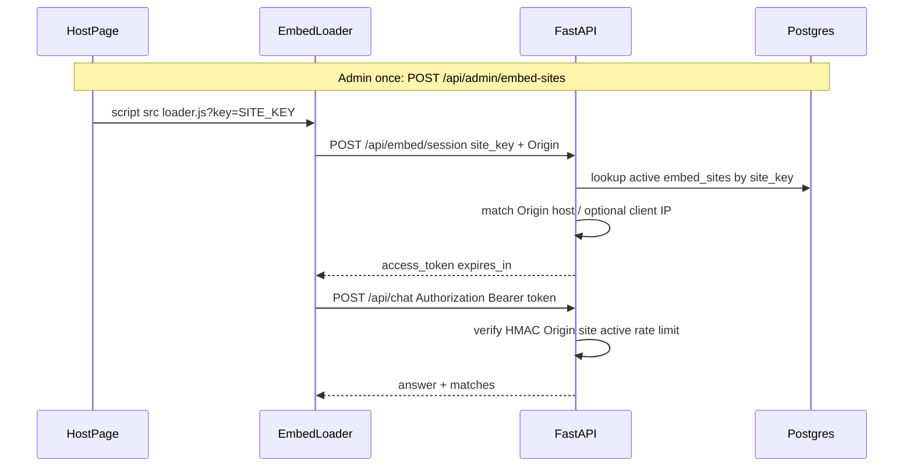

# Embed Abuse Protection — Domain Keys & Session Tokens

**Author:** Sanju  
**Date:** 2026-08-06  
**Branch:** `feature/embeddable-chat-widget`

This document describes the **embed abuse-protection** feature: registering websites with unique site keys, issuing short-lived domain-bound session tokens, dynamic CORS, rate limits, and HTTPS/security headers so unauthorized hosts cannot freely call the resume chat API.

Related widget install docs: [README.md](./README.md).

---

## What has been done

| Capability | Behaviour |
|------------|-----------|
| Domain registration | Admin registers a hostname → unique public `site_key` (`aicv_…`) |
| Snippet generation | Loader URL includes `?key=…`; API can generate the one-liner |
| Session minting | `POST /api/embed/session` validates Origin/Referer (+ optional IP allowlist) |
| Chat/search gate | Bearer token required when `EMBED_AUTH_REQUIRED=true` (default) |
| Token design | HMAC-SHA256, ~10 min TTL, bound to `site_id` + origin host |
| Dynamic CORS | Only `FRONTEND_ORIGIN` + active registered domains (not open `*` by default) |
| Rate limits | In-process sliding window per IP and per site key |
| Transport hardening | Security headers; HTTPS enforced in production |
| Ops CLI | `scripts/register_embed_site.py` prints key + snippet |
| Next.js compatibility | Frontend attaches the same Bearer token via `NEXT_PUBLIC_EMBED_SITE_KEY` |

**Not in scope:** end-user OAuth, CAPTCHA/WAF, Redis-backed distributed rate limits.

---

## Architecture / structure

```
aiCVchat/
├── embed/                          # Standalone widget (no Next.js)
│   ├── aicvchat-widget.js          # UI + ensureSession() + Authorization on chat
│   ├── config.js                   # siteKey, apiBaseUrl, paths
│   ├── demo.html / snippet.html    # Demo & snippet helper (?key=)
│   ├── README.md                   # Widget install guide
│   └── ABUSE_PROTECTION.md         # This document
├── backend/
│   ├── app/
│   │   ├── models/embed_site.py    # embed_sites table
│   │   ├── schemas/embed.py        # Create/Out/Session DTOs
│   │   ├── core/
│   │   │   ├── embed_tokens.py     # HMAC mint/verify + site_key gen
│   │   │   ├── rate_limit.py       # Sliding-window limiters
│   │   │   ├── middleware.py       # Dynamic CORS + security headers
│   │   │   └── config.py           # EMBED_* / CORS settings (modified)
│   │   ├── services/embed_site_service.py  # Domain/IP/CORS helpers
│   │   ├── api/
│   │   │   ├── embed.py            # loader, snippet, session
│   │   │   ├── deps.py             # require_embed_session
│   │   │   ├── admin.py            # embed-sites CRUD (modified)
│   │   │   ├── chat.py / search.py # gated (modified)
│   │   │   └── …
│   │   └── db/init_db.py           # registers EmbedSite (modified)
│   ├── scripts/register_embed_site.py
│   └── main.py                     # middleware + /embed mount (modified)
└── frontend/
    ├── lib/embedAuth.ts            # Session helper for Next app
    └── components/ChatPanel.tsx, ResultsPanel.tsx  # send Bearer (modified)
```

### Database

Table **`embed_sites`**:

| Column | Type | Notes |
|--------|------|--------|
| `id` | UUID | PK |
| `site_key` | string | Unique public key |
| `name` | string | Ops label |
| `domain` | string | Normalized hostname |
| `allow_subdomains` | bool | Allow `*.domain` |
| `allowed_ips` | JSON list | Empty = any IP |
| `is_active` | bool | False after revoke |
| `rate_limit_per_minute` | int | Per-site budget |
| `created_at` / `revoked_at` | datetime | Lifecycle |

Created via SQLAlchemy `create_all` on startup (no Alembic).

---

## Request flow



1. **Register** domain (admin token) → receive `site_key` + HTML snippet.  
2. **Install** `<script src="https://api…/embed/loader.js?key=…">` on that domain only.  
3. Widget **opens session**; server checks Origin against registered domain.  
4. Widget **chats** with `Authorization: Bearer <token>`; token expires (~600s) and is refreshed client-side before expiry.

---

## Files added

### Backend (new)

| File | Role |
|------|------|
| [`backend/app/models/embed_site.py`](../backend/app/models/embed_site.py) | ORM model |
| [`backend/app/schemas/embed.py`](../backend/app/schemas/embed.py) | Pydantic DTOs |
| [`backend/app/core/embed_tokens.py`](../backend/app/core/embed_tokens.py) | Token mint/verify, key generation |
| [`backend/app/core/rate_limit.py`](../backend/app/core/rate_limit.py) | IP/site sliding windows |
| [`backend/app/core/middleware.py`](../backend/app/core/middleware.py) | Dynamic CORS + security headers |
| [`backend/app/services/embed_site_service.py`](../backend/app/services/embed_site_service.py) | Domain/IP/CORS cache helpers |
| [`backend/app/api/deps.py`](../backend/app/api/deps.py) | `require_embed_session` dependency |
| [`backend/app/api/embed.py`](../backend/app/api/embed.py) | Loader, snippet, session endpoints |
| [`backend/scripts/register_embed_site.py`](../backend/scripts/register_embed_site.py) | CLI registration |

### Embed package (new folder)

| File | Role |
|------|------|
| `embed/aicvchat-widget.js` | Widget UI + session + chat |
| `embed/config.js` | Defaults including `siteKey` |
| `embed/demo.html` / `snippet.html` | Local helpers |
| `embed/README.md` | Widget usage |
| `embed/ABUSE_PROTECTION.md` | This feature doc |

### Frontend (new)

| File | Role |
|------|------|
| [`frontend/lib/embedAuth.ts`](../frontend/lib/embedAuth.ts) | Obtain/cache Bearer token for Next.js |

---

## Files modified

| File | Change |
|------|--------|
| `backend/app/core/config.py` | `EMBED_*` settings; `cors_allow_any_origin` default `false` |
| `backend/main.py` | Dynamic CORS/security middleware; `/embed` static mount |
| `backend/app/api/admin.py` | Embed-site create/list/revoke/rotate-key |
| `backend/app/api/chat.py` | `Depends(require_embed_session)` |
| `backend/app/api/search.py` | Same gate |
| `backend/app/db/init_db.py` | Import `EmbedSite` for `create_all` |
| `backend/app/db/session.py` | DB `connect_timeout` (startup resilience) |
| `backend/.env.example` | Document embed/CORS env vars |
| `frontend/components/ChatPanel.tsx` | Send `Authorization` via `authHeaders` |
| `frontend/components/ResultsPanel.tsx` | Same for search |
| `frontend/.env.example` | `NEXT_PUBLIC_EMBED_SITE_KEY` |

---

## Impact

| Area | Impact |
|------|--------|
| **Third-party embeds** | Must use a registered domain + `site_key`; hotlinking another site’s key fails Origin check |
| **Open API abuse** | `/api/chat` and `/api/search` reject unauthenticated callers when auth is on |
| **CORS** | Unknown origins no longer get `*`; set `CORS_ALLOW_ANY_ORIGIN=true` only as emergency |
| **Next.js UI** | Needs `NEXT_PUBLIC_EMBED_SITE_KEY` for `localhost` (or your front host), or chat returns 401 |
| **Ops** | Register each customer domain before go-live; rotate keys on compromise |
| **Postgres** | New `embed_sites` table; backend must reach DB for registration/session (chat still needs DB for resumes) |
| **Performance** | Token verify is local HMAC; CORS origins cached ~30s; rate limits are in-process (per machine) |

**Break-glass (local only):** `EMBED_AUTH_REQUIRED=false` — disables the chat/search gate. Do not use in production.

---

## Environment variables

| Variable | Default | Meaning |
|----------|---------|---------|
| `EMBED_AUTH_REQUIRED` | `true` | Gate chat/search with Bearer token |
| `EMBED_TOKEN_SECRET` | _(empty → weak dev fallback)_ | HMAC secret — **set in production** |
| `EMBED_TOKEN_TTL_SECONDS` | `600` | Session lifetime |
| `EMBED_RATE_LIMIT_PER_MINUTE` | `20` | Per client IP |
| `EMBED_SITE_RATE_LIMIT_PER_MINUTE` | `60` | Per site key |
| `EMBED_REQUIRE_HTTPS` | _(unset → on if `APP_ENV=production`)_ | Reject non-HTTPS sessions/chat |
| `CORS_ALLOW_ANY_ORIGIN` | `false` | Emergency open CORS |
| `FRONTEND_ORIGIN` | `http://localhost:3000` | Always-allowed frontends (comma-separated) |
| `ADMIN_TOKEN` | — | Required for site registration APIs |
| `NEXT_PUBLIC_EMBED_SITE_KEY` | — | Site key for the Next.js app origin |
| `NEXT_PUBLIC_API_BASE_URL` | `http://localhost:8000` | API base for Next.js |

---

## How to use

### 1. Start backend (Postgres required for sites table)

```bash
cd backend
# ensure .env has EMBED_AUTH_REQUIRED=true and EMBED_TOKEN_SECRET=…
python main.py
```

### 2. Register a domain

```bash
cd backend
python scripts/register_embed_site.py --name "Local demo" --domain localhost
```

Or:

```bash
curl -X POST http://localhost:8000/api/admin/embed-sites \
  -H "X-Admin-Token: YOUR_ADMIN_TOKEN" \
  -H "Content-Type: application/json" \
  -d "{\"name\":\"Acme Careers\",\"domain\":\"careers.acme.com\",\"allow_subdomains\":false}"
```

Response includes `site_key` and `snippet`.

**Admin extras:**

- `GET /api/admin/embed-sites` — list  
- `POST /api/admin/embed-sites/{id}/revoke` — deactivate  
- `POST /api/admin/embed-sites/{id}/rotate-key` — new key (update all snippets)

### 3. Install on the website

Paste the snippet (host + key already filled):

```html
<script src="https://YOUR-API-HOST/embed/loader.js?key=aicv_…" async></script>
```

Optional: `openOnLoad=1`, `position=left`.

Helpers:

- `http://localhost:8000/embed/demo.html?key=aicv_…`
- `http://localhost:8000/embed/snippet.html?key=aicv_…`
- `GET /api/embed/snippet?key=aicv_…`

### 4. Next.js local app

1. Register `--domain localhost` (covers `localhost` / `127.0.0.1` for session matching).  
2. Set in `frontend/.env.local`:

```env
NEXT_PUBLIC_API_BASE_URL=http://localhost:8000
NEXT_PUBLIC_EMBED_SITE_KEY=aicv_your_key_here
```

3. Restart `npm run dev`.

### 5. Production checklist

- [ ] Strong `EMBED_TOKEN_SECRET` and `ADMIN_TOKEN`  
- [ ] `EMBED_AUTH_REQUIRED=true`  
- [ ] `CORS_ALLOW_ANY_ORIGIN=false`  
- [ ] `APP_ENV=production` (or `EMBED_REQUIRE_HTTPS=true`) behind TLS  
- [ ] Register only real customer hostnames  
- [ ] Prefer IP allowlists for high-risk embeds  
- [ ] Plan Redis rate limits if you run multiple API instances  

---

## API quick reference

| Method | Path | Auth | Purpose |
|--------|------|------|---------|
| `POST` | `/api/admin/embed-sites` | `X-Admin-Token` | Register domain → `site_key` |
| `GET` | `/api/admin/embed-sites` | `X-Admin-Token` | List sites |
| `POST` | `/api/admin/embed-sites/{id}/revoke` | `X-Admin-Token` | Deactivate |
| `POST` | `/api/admin/embed-sites/{id}/rotate-key` | `X-Admin-Token` | New key |
| `POST` | `/api/embed/session` | Origin + `site_key` body | Mint Bearer token |
| `GET` | `/embed/loader.js?key=` | — | Dynamic loader JS |
| `GET` | `/api/embed/snippet?key=` | — | Generated HTML snippet |
| `POST` | `/api/chat` | Bearer (if auth on) | Chat |
| `POST` | `/api/search` | Bearer (if auth on) | Search |

### Session request / response

**Request body:** `{ "site_key": "aicv_…" }`  
**Headers:** browser sends `Origin` (or `Referer`).

**Response:**

```json
{
  "access_token": "…",
  "expires_in": 600,
  "api_base_url": "https://api.example.com",
  "token_type": "Bearer"
}
```

---

## Security notes for future development

- Site keys in HTML are **public**; never treat them as passwords. Binding + short TTL + rate limits + HTTPS are the real controls.  
- On revoke/rotate, invalidate CORS cache is already called (`invalidate_cors_cache`).  
- Multi-instance: replace `ip_limiter` / `site_limiter` in `rate_limit.py` with Redis.  
- New endpoints that burn LLM/DB should use `Depends(require_embed_session)` the same way as chat/search.

---

## License

Same as the parent repository.
